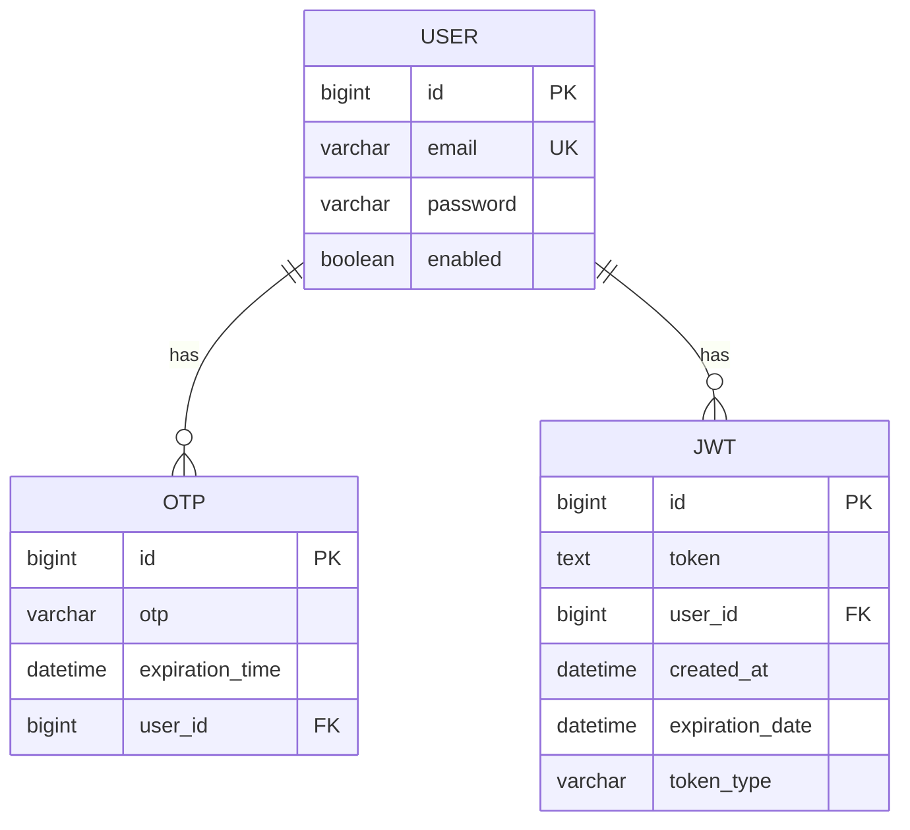

# User Service Schema

## ERD Diagram

Below is the Entity-Relationship Diagram (ERD) for the User Service, which includes the `user`, `otp`, and `jwt` tables.

# Create the database
CREATE DATABASE user_service;
USE user_service;

-- Create User table
CREATE TABLE user (
    id BIGINT AUTO_INCREMENT PRIMARY KEY,
    email VARCHAR(255) NOT NULL UNIQUE,
    password VARCHAR(255) NOT NULL,
    enabled BOOLEAN DEFAULT FALSE
);

-- Create OTP table
CREATE TABLE otp (
    id BIGINT AUTO_INCREMENT PRIMARY KEY,
    otp VARCHAR(6) NOT NULL,
    expiration_time DATETIME NOT NULL,
    user_id BIGINT,
    FOREIGN KEY (user_id) REFERENCES user(id) ON DELETE CASCADE
);

-- Create JWT table
CREATE TABLE jwt (
    id BIGINT AUTO_INCREMENT PRIMARY KEY,
    token TEXT NOT NULL,
    user_id BIGINT,
    created_at DATETIME NOT NULL,
    expiration_date DATETIME NOT NULL,
    token_type VARCHAR(50) NOT NULL,
    FOREIGN KEY (user_id) REFERENCES user(id) ON DELETE CASCADE
);
