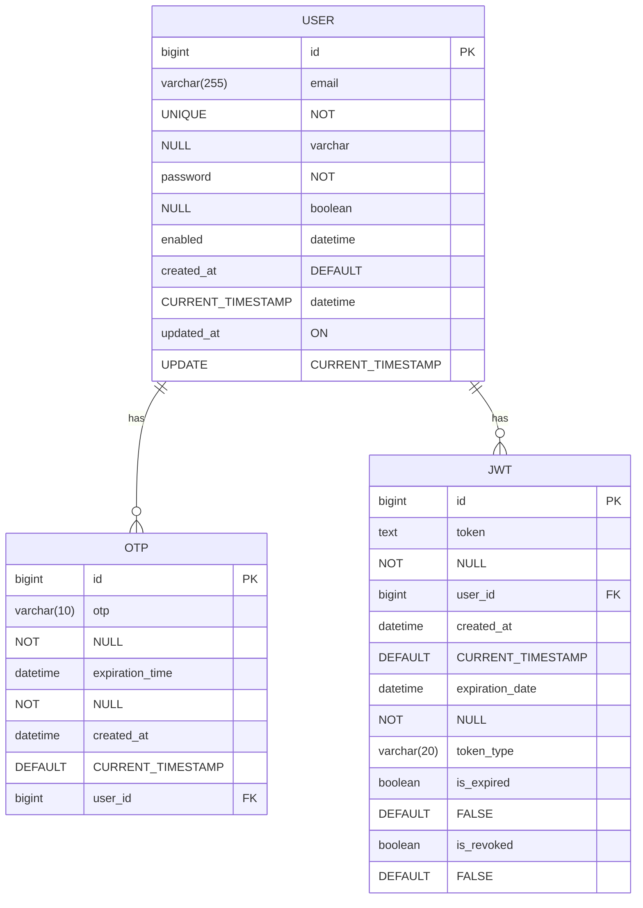

# User Service Schema

## ERD Diagram

the Entity-Relationship Diagram (ERD) for the User Service, which includes the `user`, `otp`, and `jwt` tables.

```mermaid
erDiagram
    USER ||--o{ OTP : has
    USER ||--o{ JWT : has

    USER {
        bigint id PK
        varchar(255) email UNIQUE NOT NULL
        varchar password NOT NULL
        boolean enabled
        datetime created_at DEFAULT CURRENT_TIMESTAMP
        datetime updated_at ON UPDATE CURRENT_TIMESTAMP
    }

    OTP {
        bigint id PK
        varchar(10) otp NOT NULL
        datetime expiration_time NOT NULL
        datetime created_at DEFAULT CURRENT_TIMESTAMP
        bigint user_id FK
    }

    JWT {
        bigint id PK
        text token NOT NULL
        bigint user_id FK
        datetime created_at DEFAULT CURRENT_TIMESTAMP
        datetime expiration_date NOT NULL
        varchar(20) token_type
        boolean is_expired DEFAULT FALSE
        boolean is_revoked DEFAULT FALSE
    }
```
ذذذ
